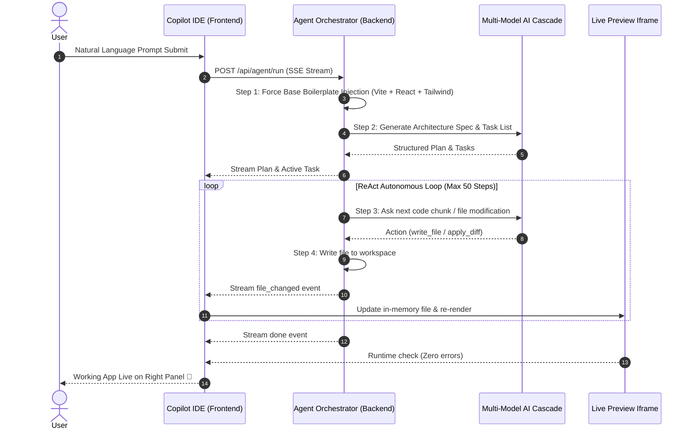

# 🚀 AI-Dost Copilot — Complete Architecture & User Guide

> **AI-Dost Copilot** ek **Autonomous Multi-Agent Full-Stack Software Engineer** hai jo sirf code suggest nahi karta, balki ek single natural language prompt se complete full-stack web applications build, test, preview, aur self-heal karta hai.

---

## 📑 Table of Contents
1. [Copilot Kya Hai? (Overview)](#1-copilot-kya-hai-overview)
2. [Copilot Ka 3-Pillar Architecture (Brain + Hands + Eyes)](#2-copilot-ka-3-pillar-architecture-brain--hands--eyes)
3. [Copilot Kaise Kaam Karta Hai? (Step-by-Step Workflow)](#3-copilot-kaise-kaam-karta-hai-step-by-step-workflow)
4. [Core Features & Capabilities](#4-core-features--capabilities)
5. [Multi-Model Cascade Engine (AI Routing)](#5-multi-model-cascade-engine-ai-routing)
6. [Live Preview & In-Browser Sandbox](#6-live-preview--in-browser-sandbox)
7. [Visual QA & Autonomous Self-Healing](#7-visual-qa--autonomous-self-healing)
8. [Keyboard Shortcuts & Cheat Sheet](#8-keyboard-shortcuts--cheat-sheet)
9. [Project Codebase Structure](#9-project-codebase-structure)
10. [Troubleshooting & FAQs](#10-troubleshooting--faqs)

---

## 1. Copilot Kya Hai? (Overview)

Traditional AI tools (jaise basic chatbots) sirf text ya code snippets dete hain jise developer ko manually copy-paste karna padta hai. 

**AI-Dost Copilot** ek **Autonomous AI Developer Platform** hai (equivalent to *Bolt.new* + *Replit Agent* + *Cursor IDE*):
- 💡 **One-Prompt Fullstack Generator:** "Build a modern crypto analytics dashboard with charts and real-time simulator" bolne par poori working React + Tailwind + Express app ready kar deta hai.
- ⚡ **Zero Setup Live Preview:** Jaise hi code generate hota hai, right side ke preview panel mein app instant live load ho jati hai (Hot Reloading ke saath).
- 🛠️ **Integrated IDE:** Monaco code editor, file tree explorer, interactive xterm terminal, aur Git version control ek hi unified dashboard mein integrated hain.

---

## 2. Copilot Ka 3-Pillar Architecture (Brain + Hands + Eyes)

```
                     ┌─────────────────────────────┐
                     │   User Natural Language     │
                     │          Prompt             │
                     └──────────────┬──────────────┘
                                    │
                                    ▼
┌────────────────────────────────────────────────────────────────────────┐
│ 🧠 1. THE BRAIN (Cognitive Architect & Planner)                        │
│ - Smart Intent Classifier (Chat vs Project vs Edit vs Debug)           │
│ - Dynamic Task Planner (Breaks goal into 5-8 sequential phases)        │
│ - Multi-Model Cascade (OpenAI GPT-4o -> Groq -> Gemini -> OpenRouter)   │
└───────────────────────────────────┬────────────────────────────────────┘
                                    │
                                    ▼
┌────────────────────────────────────────────────────────────────────────┐
│ ✋ 2. THE HANDS (Autonomous Tool Execution Engine)                     │
│ - Base Template Injector (package.json, vite.config, main.jsx, html)   │
│ - Recursive ReAct Tool Loop (write_file, apply_diff, read_file)        │
│ - Workspace File Sync (SQLite persistence + file tree watcher)         │
│ - WebContainer Sandbox / Live Dev Server                               │
└───────────────────────────────────┬────────────────────────────────────┘
                                    │
                                    ▼
┌────────────────────────────────────────────────────────────────────────┐
│ 👁️ 3. THE EYES (Visual QA & Self-Healing Telemetry)                    │
│ - In-Memory REST Router (Mock /api endpoints for preview)              │
│ - Iframe Runtime Error Telemetry (window.onerror & Babel capture)       │
│ - DOM Layout Anomaly Detector (Horizontal overflow & missing elements) │
│ - Auto-Patch Loop (Fixes runtime crashes automatically)                │
└────────────────────────────────────────────────────────────────────────┘
```

---

## 3. Copilot Kaise Kaam Karta Hai? (Step-by-Step Workflow)

Jab aap Copilot chat mein koi prompt dete hain (e.g. *"Build an AI SaaS Landing Page with pricing calculator"*), toh parde ke peeche yeh steps hote hain:



---

## 4. Core Features & Capabilities

| Feature | Description | Shortcut / Trigger |
|---|---|---|
| **Autonomous Project Generation** | Single prompt se multi-file application scaffold karna. | Prompt Input |
| **Split Workspace IDE** | Left side mein Monaco Code Editor, Right side mein Live Preview. | Top Bar Toggle |
| **Inline AI Editor (Ctrl+K)** | Code select karke inline instructions se targeted refactor karna. | `Ctrl+K` |
| **Template Hub Modal** | Pre-designed starter archetypes (E-Commerce, Kanban, AI Studio, Dashboard). | `App Wizard` / `Template Hub` |
| **In-Browser Terminal** | Real-time terminal output, xterm console, dev command execution. | Bottom Drawer |
| **Visual QA Inspector** | UI layout breaks, overflow issues, aur missing elements scan karna. | `Visual QA` Button |
| **Responsive Device Switcher**| Desktop ($100\%$), Tablet ($768\text{px}$), Mobile ($375\text{px}$) viewports. | Preview Top Bar |
| **Offline Git Panel** | Local commits create karna, commit history browse karna, rollback karna. | `Ctrl+Shift+G` |
| **Export Project ZIP** | Poore project ko standard source code ZIP file mein download karna. | `ZIP` Button (Top Bar) |

---

## 5. Multi-Model Cascade Engine (AI Routing)

Copilot kisi ek single AI provider par depend nahi karta. Isme ek resilient **Multi-Tier Cascade Engine** laga hua hai:

```
[User Request]
      │
      ▼
1. OpenAI (GPT-4o / GPT-4o-mini)  ──(If active key & credits)──► Execute
      │ (Quota limit / Error)
      ▼
2. Groq (Llama 3.3 70B - 500 T/s) ──(If active)──────────────► Execute
      │ (Error / Rate Limit)
      ▼
3. Google Gemini (1.5 Flash)      ──(If active)──────────────► Execute
      │ (Error / Rate Limit)
      ▼
4. OpenRouter Free Tier           ──(11+ Free Models)────────► Execute
      │ (Error / Rate Limit)
      ▼
5. Local Ollama (Qwen 2.5 Coder)  ──(100% Offline fallback)──► Execute
      │ (If Ollama down)
      ▼
6. Golden Deterministic Boilerplate (Zero-failure template engine)
```

---

## 6. Live Preview & In-Browser Sandbox

Copilot ka live preview browser ke andar run hota hai:
1. **Isolated Iframe Sandbox:** Secure `sandbox="allow-scripts allow-same-origin allow-forms allow-popups allow-modals"` permissions ke sath run hota hai.
2. **In-Memory REST Mock Router:** Agar generated frontend code `fetch('/api/notes')` ya `fetch('/api/items')` call kare, toh browser preview crash nahi hota — preview script in-memory JSON database se mock response supply kar deta hai.
3. **Babel Standalone + Tailwind CDN:** JSX aur Modern CSS real-time compile hoti hai bina external build pipeline ke.

---

## 7. Visual QA & Autonomous Self-Healing

Jab code generate hota hai ya runtime error aata hai:
1. **Iframe Telemetry Pipe:** Iframe ke `window.onerror` aur syntax errors seedhe Copilot Brain ko feed hote hain.
2. **Auto-Patch Trigger:** Agar koi code bracket miss ho gaya ya import galat ho gaya, Copilot automatic `apply_diff` patch generate karke file theek kar deta hai.
3. **DOM Layout Anomaly Detector:** Screen se bahar nikalne wala text (Horizontal Overflow) ya invisible buttons detect karke visual CSS fix karta hai.

---

## 8. Keyboard Shortcuts & Cheat Sheet

| Shortcut | Function |
|---|---|
| `Ctrl+Enter` | Copilot prompt submit karein |
| `Ctrl+K` | Monaco editor mein selected code par Inline AI edit open karein |
| `Ctrl+Shift+S` | Sidebar collapse/expand toggle karein |
| `Ctrl+Shift+P` | Agent Planner mode open karein |
| `Ctrl+Shift+G` | Local Git Control Modal open karein |
| `Mod+C` | Voice Command Palette open karein |
| `Ctrl+Shift+V` | Voice Input microphone toggle karein |
| `F1` | Help / Shortcut cheat sheet |

---

## 9. Project Codebase Structure

Copilot engine in main files ke zariye operate karta hai:

```
ai-dost version 2.o/
├── frontend/
│   ├── components/views/
│   │   ├── CopilotIDE.jsx         # Main Copilot IDE (Editor + Live Preview + Terminal)
│   │   ├── CopilotTree.jsx        # VS Code-style File Tree Explorer with Context Menu
│   │   ├── TemplateHubModal.jsx   # Starter Template Archetype Selection Cards
│   │   ├── VisualDebugger.jsx     # Visual QA layout anomaly inspector
│   │   └── ProjectWizardModal.jsx # Multi-step project generator wizard
│   └── lib/
│       └── webcontainer.js        # WebAssembly Node.js in-browser runtime
│
├── backend/
│   ├── routes/
│   │   └── agent.js               # /api/agent/run SSE stream, ReAct loop, tool execution
│   ├── agent/
│   │   ├── orchestrator.js        # Multi-agent planner, tool dispatcher & boilerplate injector
│   │   ├── visualRepair.js        # Visual anomaly analyzer & patch generator
│   │   └── fullstackTrainer.js    # Category & framework intent classifier
│   └── services/
│       ├── openaiService.js       # OpenAI GPT-4o / GPT-4o-mini client
│       ├── groqService.js         # Groq ultra-fast Llama 3.3 / Qwen client
│       ├── geminiService.js       # Google Gemini Flash client
│       └── openrouterService.js   # OpenRouter 11+ free models cascade client
```

---

## 10. Troubleshooting & FAQs

### Q1: Live Preview white screen kyu dikhata hai?
- **Answer:** Iframe ke sandbox permissions mein `allow-same-origin` hona zaroori hai (jo ab permanently hardcode ho chuka hai). Agar tab bhi issue aaye, toh top bar ke **`Reload Preview`** button par click karein.

### Q2: Kya mujhe paid OpenAI key ki zaroorat hai?
- **Answer:** Nahi! AI-Dost 100% free models (Groq Llama 3.3 70B, Google Gemini Flash, OpenRouter free models, aur Local Ollama) par seamlessly kaam karta hai.

### Q3: Server start kaise karein?
```powershell
# 1. Backend Server
cd backend
node server.js

# 2. Frontend Dev Server
cd frontend
npm run dev
```

---

*AI-Dost v2.0 Copilot Engine — Empowering developers with autonomous, self-healing AI development.*
