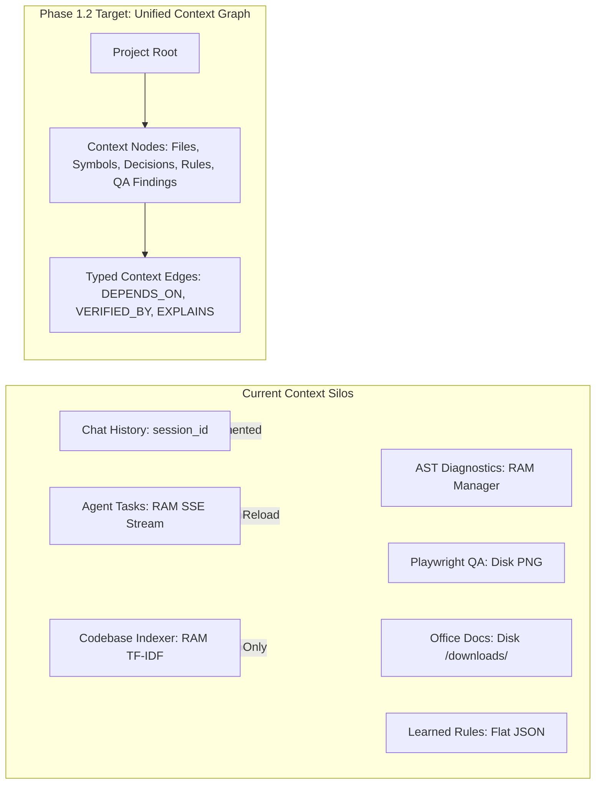
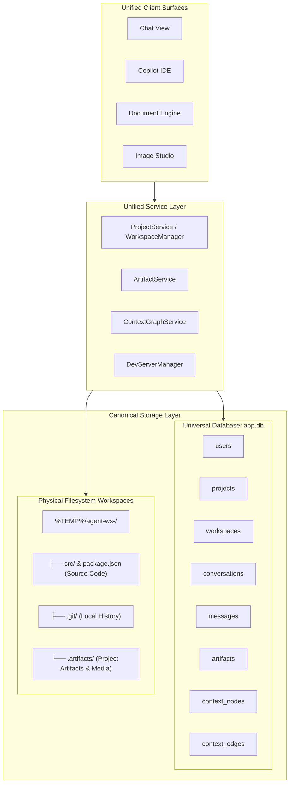

# Phase 1.2 — Architecture Discovery & System Evolution Audit

> **Document Type:** Deep Architecture Discovery, Repository Inventory & System Evolution Blueprint  
> **Status:** AUDIT & DESIGN COMPLETE — PENDING ARCHITECTURAL REVIEW & APPROVAL  
> **Scope:** Discovery & Target Architecture Specification Only (**Zero Source Edits / Zero Commits / Zero Pushes**)  
> **Baseline Commit:** `9c5d44c` (`feat(agent): implement playwright visual verification loop`)  
> **Target Milestone:** Phase 1.2 — Unified Workspace & Storage Consolidation

---

## 1. Executive Summary

AI-Dost has completed and verified the foundation across **Phase 0.1** (Persistent Sandbox & Live Preview Proxy), **Phase 0.2** (Playwright Visual Verification Loop), and **Phase 1.1** (Universal Project Store & Unified Context Foundation). 

While Phase 1.1 established the **Dual-Storage Single-Source-of-Truth Invariant** (Physical Workspace on disk as authoritative for executable code/Git; Universal Database `app.db` as authoritative for metadata, lineage, conversations, artifacts, and context graph), a comprehensive repository-wide audit reveals that **legacy routes, document generators, image pipelines, chat handlers, and the agent orchestrator still maintain partial bypasses and ad-hoc storage silos**.

This document presents the **Phase 1.2 Architecture Discovery & System Evolution Audit**. It provides an exhaustive inventory of all 18 backend subsystems and 7 frontend views, maps the actual runtime execution and context propagation flows, audits security and concurrency risks, defines the architectural debt map, and details the Phase 1.2 target architecture, data model evolution, and migration strategy.

---

## 2. Current Architecture Map

```mermaid
graph TD
    subgraph Frontend [Frontend Surfaces]
        UI_Chat[ChatView]
        UI_IDE[CopilotIDE]
        UI_Docs[DocumentsView]
        UI_Img[ImageStudio]
        UI_Resume[ResumeBuilder]
        UI_Kanban[KanbanBoard]
    end

    subgraph API [Express API Router & Legacy Routes]
        R_Chat["/api/v1/chat & /api/chat/history"]
        R_Agent["/api/agent/run (SSE Stream)"]
        R_Docs["/api/document/generate"]
        R_Img["/api/image/generate"]
        R_Preview["/api/preview/:id"]
        R_Memory["/api/memory/project & /api/projects"]
        R_Learning["/api/learning (brain_memory.json)"]
    end

    subgraph CoreServices [Core Platform Services]
        Svc_Proj[projectService.js]
        Svc_Dev[devServerManager.js]
        Svc_Sand[SandboxManager.js]
        Svc_Vis[VisualVerifier.js]
        Svc_Diag[DiagnosticManager.js]
        Svc_Diff[DiffEngine.js]
        Svc_Lock[LockManager.js]
        Svc_Sched[TaskScheduler.js]
        Svc_Ctx[ContextRetriever.js]
    end

    subgraph StorageTier [Dual-Storage Foundation]
        subgraph UniversalDB [Universal SQLite DB: backend/data/app.db]
            DB_Users[users]
            DB_Projects[projects]
            DB_Workspaces[workspaces]
            DB_Convs[conversations]
            DB_Msgs[messages]
            DB_Artifacts[artifacts]
            DB_Nodes[context_nodes]
            DB_Edges[context_edges]
            DB_LegacyMirror["workspace_files (Legacy Mirror)"]
        end

        subgraph PhysicalDisk [Physical Disk Filesystem]
            FS_WS["%TEMP%/agent-ws-<projectId>/ (Source + Git)"]
            FS_Docs["frontend/public/downloads/ (Static Documents)"]
            FS_Uploads["backend/uploads/ (Generated Images)"]
            FS_Brain["backend/data/personal_brain_memory.json"]
        end
    end

    UI_Chat --> R_Chat
    UI_IDE --> R_Agent
    UI_IDE --> R_Preview
    UI_IDE --> R_Memory
    UI_Docs --> R_Docs
    UI_Img --> R_Img
    UI_Resume --> R_Chat

    R_Agent --> Svc_Proj
    R_Agent --> Svc_Dev
    R_Agent --> Svc_Vis
    R_Agent --> Svc_Diag
    R_Agent --> Svc_Diff
    R_Agent --> Svc_Lock
    R_Agent --> Svc_Sched
    R_Agent --> Svc_Ctx

    Svc_Proj --> UniversalDB
    Svc_Dev --> FS_WS
    Svc_Vis --> FS_WS
    Svc_Diff --> FS_WS

    R_Chat -.-> DB_LegacyMirror
    R_Memory -.-> DB_LegacyMirror
    R_Docs -.-> FS_Docs
    R_Img -.-> FS_Uploads
    R_Learning -.-> FS_Brain
```



---

## 3. Actual End-to-End Execution Flow

```mermaid
sequenceDiagram
    autonumber
    actor User
    participant IDE as CopilotIDE.jsx
    participant Route as routes/agent.js
    participant Orch as AgentOrchestrator
    participant DevSrv as devServerManager
    participant Disk as %TEMP%/agent-ws-<id>
    participant Verifier as VisualVerifier
    participant DB as Universal DB (app.db)

    User->>IDE: "Build a fullstack React Todo app"
    IDE->>Route: POST /api/agent/run { prompt, projectId: "proj_123" }
    Route->>Orch: new AgentOrchestrator({ projectPath })
    Route->>IDE: SSE headers 200 (text/event-stream)
    
    rect rgb(30, 30, 45)
        Note over Orch,Disk: Autonomous Brain Loop (ReAct)
        Orch->>Orch: detectCategory & plan_project (AST / Spec)
        Orch->>Route: SSE event: "plan" { tasks: [...] }
        Orch->>Disk: write_file("package.json", ...) & apply_diff(...)
        Orch->>Route: SSE event: "step" { action: "write_file", path: "src/App.jsx" }
    end

    rect rgb(35, 45, 35)
        Note over Orch,DevSrv: Runtime & Dev-Server Spin-up
        Orch->>DevSrv: startDevServer("proj_123", wsPath)
        DevSrv->>Disk: spawn("npm run dev -- --host 0.0.0.0")
        DevSrv-->>Orch: status: "READY", hostPort: 8801, url: "http://localhost:8801"
    end

    rect rgb(45, 35, 35)
        Note over Orch,Verifier: Visual Verification (Playwright)
        Orch->>Verifier: verify("http://localhost:8801", { projectId: "proj_123" })
        Verifier->>Verifier: Chromium page.goto & console error intercept
        Verifier->>Disk: Save screenshot to .artifacts/verification/shot.png
        Verifier-->>Orch: result: { success: true, pageErrors: 0, status: "PASS" }
    end

    Orch->>Route: SSE event: "done" { summary: "Project complete", steps: 14 }
    Route->>IDE: SSE stream closed (res.end())
```



---

## 4. Component Inventory & Responsibility Map

| Subsystem | Primary Source File | Primary Responsibility | Current Persistence / Storage |
| :--- | :--- | :--- | :--- |
| **Agent Orchestrator** | `backend/agent/orchestrator.js` | Autonomous ReAct execution, tool routing, self-healing loop | In-memory RAM during SSE execution |
| **Smart Diff Engine** | `backend/agent/diffEngine.js` | 4-tier fuzzy patch matching with before/after SHA-256 validation | Disk filesystem (`%TEMP%/agent-ws-<id>`) |
| **Lock Manager** | `backend/agent/concurrency/LockManager.js` | FIFO per-file async mutex with 30s timeout | In-memory `Map` in Node runtime |
| **Task Scheduler** | `backend/agent/concurrency/TaskScheduler.js` | Dependency DAG topological sorting and cycle abort | In-memory RAM per batch |
| **AST Diagnostics** | `backend/agent/diagnostics/` | JS/TS syntax error detection & ESLint rule validation | In-memory RAM |
| **Dev Server Manager** | `backend/sandbox/devServerManager.js` | Framework detection, dynamic port allocation, child process management | In-memory `Map` (`this.servers`) |
| **Live Preview Proxy** | `backend/routes/preview.js` | Reverse HTTP proxy & WebSocket HMR forwarding (`/api/preview/:id`) | Reads devServerManager RAM or fallback SQLite |
| **Visual Verifier** | `backend/agent/verification/VisualVerifier.js` | Headless Chromium inspection, console fatality classification, screenshot capture | Disk: `<ws>/.artifacts/verification/*.png` |
| **Sandbox Manager** | `backend/sandbox/sandboxManager.js` | Docker container isolation, volume mounts, port bindings | In-memory `Map` (`this.containers`) + Docker daemon |
| **Universal Project Store** | `backend/db/` & `backend/services/projectService.js` | Canonical metadata, relational entity DAOs, project resolver | SQLite (`backend/data/app.db` with WAL & FKs) |
| **Legacy Project Store** | `backend/projectStore.js` | Secondary mirror for CopilotIDE file tree | SQLite `workspace_files` table |
| **Unified Chat** | `backend/routes/chat.js` | Multi-model cascade (Gemini, Groq, Cerebras, NVIDIA, DeepSeek, Ollama) | Ephemeral client payload + SQLite `chat_history` |
| **Document Engine** | `backend/routes/documents.js` | DOCX, PPTX, CSV, PDF, XLSX compilation via Office libraries | Disk: `frontend/public/downloads/doc-<hash>` |
| **Image Studio** | `backend/routes/image.js` | Pollinations / Gemini image generation and rendering | Disk: `backend/uploads/gen-<timestamp>.png` |
| **Learning Engine** | `backend/routes/learning.js` | User feedback logging and rule memory | Disk: `backend/data/personal_brain_memory.json` |
| **Telegram Bot** | `backend/services/telegramBot.js` | Mobile chat, document generation, and voice commands | Long polling via Telegram Bot API |
| **Deploy Service** | `backend/routes/deploy.js` | Vercel, Netlify, Cloudflare, static zip deployment | In-memory / Child process |
| **Figma Connector** | `backend/routes/figma.js` | Figma REST API node extraction and design-to-code compiler | In-memory / REST cache |

---

## 5. Universal Project Store Compliance Audit

| Component / Subsystem | Current State Source | Correct Canonical Source | Violation? | Severity | Identified Risk & Recommended Remedy |
| :--- | :--- | :--- | :---: | :---: | :--- |
| **`server.js` Project APIs** (`/api/projects`, `/api/memory/project`) | Direct SQL `db.prepare('SELECT * FROM projects')` | `projectService.listProjects()` & `ProjectDAO` | **YES** | **MEDIUM** | Bypasses DAO validation, slug generation, and workspace binding. **Remedy:** Refactor routes to use `projectService`. |
| **`server.js` Chat History** (`/api/chat/history`, `/api/chat/save`) | Direct SQL `chat_history` table | `ConversationDAO` & `MessageDAO` | **YES** | **MEDIUM** | Chat transcripts remain unlinked to projects and users. **Remedy:** Migrate handlers to `ConversationDAO` / `MessageDAO`. |
| **`routes/documents.js`** | Unindexed files in `public/downloads/` | `ArtifactDAO` (`type: 'document_*'`) | **YES** | **HIGH** | Generated Word/PPT/Excel docs have no project association, SHA-256 tracking, or user ownership. **Remedy:** Register every generated file via `ArtifactDAO`. |
| **`routes/image.js`** | Unindexed files in `backend/uploads/` | `ArtifactDAO` (`type: 'generated_image'`) | **YES** | **HIGH** | Generated images cannot be browsed per project or attached to conversations. **Remedy:** Register in `ArtifactDAO`. |
| **`VisualVerifier.js` Screenshots** | `<ws>/.artifacts/verification/*.png` | `ArtifactDAO` (`type: 'verification_screenshot'`) | **YES** | **HIGH** | Screenshots exist on disk but cannot be referenced by Chat, Docs, or agent context. **Remedy:** Upsert into `ArtifactDAO` upon capture. |
| **`routes/learning.js`** | Global file `personal_brain_memory.json` | `ContextNodeDAO` (`type: 'RULE'`, `type: 'FEEDBACK'`) | **YES** | **MEDIUM** | Learned rules are global and cannot be scoped per project. **Remedy:** Store rules in `context_nodes`. |
| **`routes/agent.js` SSE Tasks** | Client-side React state in `CopilotIDE.jsx` | `conversations` / `context_nodes` | **YES** | **HIGH** | Agent execution plan and progress are destroyed on browser refresh. **Remedy:** Persist agent run state. |
| **`routes/preview.js` Static Fallback** | Direct SQL `SELECT content FROM workspace_files` | Physical Disk Workspace (`%TEMP%/agent-ws-<id>`) | **YES** | **MEDIUM** | Fallback preview reads stale DB rows instead of fresh disk files. **Remedy:** Read directly from disk workspace. |

---

## 6. Context Architecture Audit



### Context Characteristics:
1. **Context Ownership:** Currently fragmented. Chat owns message history; AgentOrchestrator owns tool execution; devServerManager owns port allocation; DiagnosticManager owns syntax errors.
2. **Context Lifetime:** Highly ephemeral. 70% of execution context (task checklists, step progress, AST diagnostics, visual verification reports) lives in Node.js or browser RAM and vanishes when the connection ends.
3. **Context Serialization:** No standard JSON/relational envelope exists for serializing an entire project's state.
4. **Context Invalidation:** `ContextRetriever` maintains an in-memory cache keyed by workspace hash, but does not invalidate when external tools or Git branches modify files.
5. **Context Lineage Gap:** The system cannot trace the lineage from a user prompt -> architectural decision -> modified file -> verification screenshot -> generated documentation.

---

## 7. Agent / Tool Architecture Audit

AI-Dost exposes 20 autonomous tools to the ReAct engine. The audit classifies their awareness and persistence:

| Tool Name | Category | Project Aware? | Workspace Aware? | Context Graph Aware? | Persistence Destination |
| :--- | :--- | :---: | :---: | :---: | :--- |
| `write_file` | Filesystem | 🟢 YES | 🟢 YES | 🔴 NO | Disk + SQLite `workspace_files` |
| `apply_diff` | Filesystem | 🟢 YES | 🟢 YES | 🔴 NO | Disk + SQLite `workspace_files` |
| `read_file` | Filesystem | 🟢 YES | 🟢 YES | 🔴 NO | Read-only from Disk |
| `run_terminal` | Shell Execution | 🟢 YES | 🟢 YES | 🔴 NO | Ephemeral stdout/stderr |
| `list_directory` | Filesystem | 🟢 YES | 🟢 YES | 🔴 NO | Read-only from Disk |
| `search_codebase` | RAG / Search | 🟢 YES | 🟢 YES | 🔴 NO | In-memory TF-IDF index |
| `run_tests` | Verification | 🟢 YES | 🟢 YES | 🔴 NO | Ephemeral test report |
| `take_screenshot` | Visual QA | 🟢 YES | 🟢 YES | 🔴 NO | Disk PNG file (Unindexed in DB) |
| `generate_project_from_prompt`| Scaffolding | 🟢 YES | 🟢 YES | 🔴 NO | Multi-file disk creation |
| `resume_from_chat` | Scaffolding | 🟡 PARTIAL | 🔴 NO | 🔴 NO | SQLite `resumes` table |
| `sandbox_create` | Sandbox | 🟢 YES | 🟢 YES | 🔴 NO | In-memory Map / Docker daemon |
| `sandbox_exec` | Sandbox | 🟢 YES | 🟢 YES | 🔴 NO | Ephemeral stdout/stderr |
| `sandbox_write` | Sandbox | 🟢 YES | 🟢 YES | 🔴 NO | Container volume mount |
| `sandbox_read` | Sandbox | 🟢 YES | 🟢 YES | 🔴 NO | Container volume mount |
| `sandbox_list` | Sandbox | 🟢 YES | 🟢 YES | 🔴 NO | Container volume mount |
| `sandbox_dev_start` | Runtime | 🟢 YES | 🟢 YES | 🔴 NO | In-memory Map (`devServerManager`) |
| `sandbox_dev_stop` | Runtime | 🟢 YES | 🟢 YES | 🔴 NO | Child process SIGTERM |
| `sandbox_dev_build` | Runtime | 🟢 YES | 🟢 YES | 🔴 NO | Dist folder on disk |
| `sandbox_expose` | Networking | 🟢 YES | 🟢 YES | 🔴 NO | Port binding table |
| `sandbox_destroy` | Sandbox | 🟢 YES | 🟢 YES | 🔴 NO | Container removal |

---

## 8. Event, State & Execution Model Audit

### Current Limitations:
1. **Unpersisted Agent Runs:** Each agent run is assigned an ad-hoc `runId` generated during the SSE request. When the HTTP request terminates, the `runId`, task breakdown, and step timings are discarded.
2. **No Pause / Resume:** If a long execution run (e.g. 50 steps) is interrupted by a browser disconnect, the agent cannot be resumed from step N.
3. **No Background Execution Queues:** All agent runs execute synchronously inside the Express request-response lifecycle. If the client closes the browser tab, the execution process aborts.

---

## 9. Security Architecture Audit

| Finding ID | Subsystem | Threat Description | Severity | Current Mitigation | Target Phase 1.2 Remedy |
| :--- | :--- | :--- | :---: | :--- | :--- |
| **SEC-001** | `server.js` Project APIs | Missing user ownership checks on project endpoints (`/api/memory/project/:id`). Any client can delete any project. | **HIGH** | Demo project deletion is blocked (`proj_demo_*`). | Enforce `userId` ownership verification via `ProjectDAO`. |
| **SEC-002** | `routes/preview.js` | Direct query of `workspace_files` when dev server is off bypasses physical path safety. | **MEDIUM** | Regex checks on file extensions. | Read strictly from physical workspace via `resolveSafePath`. |
| **SEC-003** | `routes/documents.js` | Static downloads served publicly from `/downloads` without project access tokens. | **LOW** | Obfuscated crypto hash filenames. | Register in `ArtifactDAO` with project authorization scoping. |
| **SEC-004** | `routes/learning.js` | Global memory file `personal_brain_memory.json` allows one project's feedback to pollute all projects. | **MEDIUM** | None. | Scope learned rules to `context_nodes` under specific `projectId`. |

---

## 10. Concurrency & Consistency Audit

1. **Database Level (EXCELLENT):** SQLite configured in WAL mode (`PRAGMA journal_mode = WAL`) with busy timeout (5000ms) and foreign keys enabled. Concurrent reads never block concurrent writes.
2. **File Mutation Level (GOOD):** `LockManager` provides per-file async FIFO mutex locking, preventing race conditions during concurrent tool calls.
3. **Dev Server & Visual Verifier Level (GOOD):** `devServerManager` dynamically allocates non-colliding host ports; `VisualVerifier` enforces port ownership per project.
4. **Agent State Machine Level (NEEDS IMPROVEMENT):** If two browser sessions trigger agent runs on the same project simultaneously, both orchestrators mutate the workspace without coordinating task state.

---

## 11. Observability Audit

* **Current Capabilities:** Structured logging via Winston (`logger.info`, `logger.warn`, `logger.error`, `logger.http`), response time headers (`X-Response-Time-Ms`), and SSE step telemetry.
* **Identified Gaps:**
  * No persistent execution audit trail in the database for autonomous agent runs.
  * No per-project token budget or latency aggregation dashboard.
  * Verification findings (console errors, DOM metrics) are lost after the run finishes.

---

## 12. Architectural Debt Map

```text
┌─────────────────────────────────────────────────────────────────────────────┐
│                          ARCHITECTURAL DEBT MATRIX                          │
├─────────┬──────────────────┬──────────────────────┬──────────┬──────────────┤
│ Debt ID │ Subsystem        │ Problem Description  │ Severity │ Target Phase │
├─────────┼──────────────────┼──────────────────────┼──────────┼──────────────┤
│ DEBT-01 │ Legacy Routes    │ Direct SQLite queries│ HIGH     │ Phase 1.2    │
│         │                  │ in server.js         │          │              │
│ DEBT-02 │ Document Engine  │ Unregistered files in│ HIGH     │ Phase 1.2    │
│         │                  │ public/downloads/    │          │              │
│ DEBT-03 │ Image Studio     │ Unregistered images  │ HIGH     │ Phase 1.2    │
│         │                  │ in backend/uploads/  │          │              │
│ DEBT-04 │ Verification QA  │ Screenshots unlinked │ HIGH     │ Phase 1.2    │
│         │                  │ from ArtifactDAO     │          │              │
│ DEBT-05 │ Learning Brain   │ Flat global JSON file│ MEDIUM   │ Phase 1.2    │
│         │                  │ instead of DB nodes  │          │              │
│ DEBT-06 │ Agent State      │ Task plans ephemeral │ HIGH     │ Phase 1.3    │
│         │                  │ in SSE stream        │          │              │
│ DEBT-07 │ ContextRetriever │ In-memory index only │ MEDIUM   │ Phase 1.3    │
│         │                  │ (no DB graph sync)   │          │              │
└─────────┴──────────────────┴──────────────────────┴──────────┴──────────────┘
```

---

## 13. Phase 1.2 Target Architecture



---

## 14. Proposed Data Model Evolution for Phase 1.2

The Phase 1.1 schema successfully created the core tables. For Phase 1.2, we propose the following schema extensions (DDL migration `002_workspace_consolidation.js`):

```sql
-- 1. Extend workspaces with consolidation metadata
ALTER TABLE workspaces ADD COLUMN root_directory TEXT DEFAULT '';
ALTER TABLE workspaces ADD COLUMN storage_type TEXT NOT NULL DEFAULT 'local_disk'; -- 'local_disk', 'docker_volume'

-- 2. Extend artifacts with source task and lineage tracking
ALTER TABLE artifacts ADD COLUMN run_id TEXT;
ALTER TABLE artifacts ADD COLUMN source_node_id TEXT;
CREATE INDEX IF NOT EXISTS idx_artifacts_project_type ON artifacts(project_id, type);
CREATE INDEX IF NOT EXISTS idx_artifacts_sha256 ON artifacts(sha256);

-- 3. Extend context_nodes with project-scoped rule and memory support
CREATE INDEX IF NOT EXISTS idx_context_nodes_project_type ON context_nodes(project_id, node_type);
CREATE INDEX IF NOT EXISTS idx_context_edges_source_target ON context_edges(source_node_id, target_node_id);
```

---

## 15. Proposed Service Boundaries & Refactoring

```text
1. WorkspaceManager (Consolidates devServerManager & project workspace resolution):
   • Responsibility: Physical workspace directory lifecycle, Git initialization, disk path safety.
   • Dependencies: WorkspaceDAO, path, fs, os.
   • Invariant: Guarantees 1:1 binding between projectId and disk workspace.

2. ArtifactService (Consolidates Document, Image, and Verification outputs):
   • Responsibility: Cataloging, SHA-256 calculation, MIME type validation, retrieval URLs.
   • Dependencies: ArtifactDAO, fs, crypto.
   • Invariant: Zero orphaned files in public/downloads or uploads.

3. ContextGraphService (Consolidates Brain Memory & Codebase Symbols):
   • Responsibility: Node creation, edge relationship wiring, project-scoped rule queries.
   • Dependencies: ContextNodeDAO, ContextEdgeDAO.
```

---

## 16. Migration Strategy (Zero Regression Guarantee)

1. **Phase 0.1 / 0.2 Protection:** Physical workspace paths (`%TEMP%/agent-ws-<projectId>`) and dynamic dev-server ports remain completely untouched.
2. **Incremental Route Delegation:**
   * Step 1: Route `/api/document/generate` registers generated Word/PPT/CSV/PDF files into `ArtifactDAO` immediately after disk write.
   * Step 2: Route `/api/image/generate` registers generated PNGs into `ArtifactDAO`.
   * Step 3: `VisualVerifier.js` registers captured screenshots into `ArtifactDAO` with `type: 'verification_screenshot'`.
   * Step 4: `server.js` legacy project and chat routes delegate queries through `ProjectService` and `ConversationDAO`.

---

## 17. Test Strategy & Acceptance Matrix for Phase 1.2

| Test Suite | Target Invariant | Acceptance Criteria |
| :--- | :--- | :--- |
| **Artifact Registration Suite** | Every generated PDF/DOCX/PPTX/PNG is indexed in `ArtifactDAO` | 100% of generated documents and images return valid `artifactId` and SHA-256. |
| **Visual QA Lineage Suite** | Playwright screenshots are registered and queryable per project | `artDAO.listByProject(projectId, 'verification_screenshot')` returns captured images. |
| **Workspace Consolidation Suite** | Physical workspace binding is 100% reliable across restarts | `WorkspaceManager.getWorkspace(projectId)` resolves correctly with zero path drift. |
| **Legacy Route Delegation Suite** | Legacy `/api/projects` and `/api/chat/history` routes use DAOs | All existing frontend views function without schema error or data loss. |
| **Regression Suite** | Phase 0.1 (14 tests), Phase 0.2 (7 tests), Phase 1.1 (16 tests) | 100% PASS across all 212+ backend tests and 24 frontend tests. |

---

## 18. Identified Risks & Trade-Offs

* **Risk:** Moving static document downloads to project-scoped paths could break direct external link downloads.  
  * **Mitigation:** Keep `/downloads/:filename` route as a backward-compatible public redirect while storing the authoritative path in `ArtifactDAO`.
* **Risk:** High volume of screenshot captures during iterative visual repair loops filling disk space.  
  * **Mitigation:** Implement artifact pruning keeping the last 5 verification screenshots per project.

---

## 19. Open Architecture Questions

1. Should Docker container sandboxes (`SandboxManager`) mount the physical workspace `%TEMP%/agent-ws-<id>` directly, or maintain an isolated sandbox copy that syncs back to disk?
   * *Proposed Consensus:* Mount the physical workspace directly as `/workspace` inside Docker to maintain a single source of truth.
2. Should agent task checklists be persisted to a dedicated `agent_tasks` table or modeled as `context_nodes` (`type: 'TASK'`)?
   * *Proposed Consensus:* Model structured tasks in Phase 1.3 via `ContextNodeDAO` to maintain a unified graph representation.

---

## 20. Architecture Decision Candidates (ADRs for Phase 1.2)

* **ADR-008 (Consolidated Artifact Registry Integration):** All document generators, image engines, and visual verifiers must register output assets in `ArtifactDAO` with SHA-256 validation.
* **ADR-009 (Workspace Directory Lifecycle Consolidation):** All filesystem mutations and dev-server workspaces must be coordinated through `WorkspaceManager`.
* **ADR-010 (Project-Scoped Rule & Memory Storage):** Deprecate global `personal_brain_memory.json` in favor of project-scoped `context_nodes`.

---

## 21. Explicit Non-Goals for Phase 1.2

* ❌ Building vector embeddings or integrating external vector databases (ChromaDB / Pinecone).
* ❌ Rewriting the frontend React components for Chat, Copilot, or Kanban.
* ❌ Modifying the Playwright Chromium verification engine internals.
* ❌ Replacing SQLite with an external PostgreSQL server in local development.

---

## 22. Recommended Implementation Sequence for Phase 1.2

```text
Milestone 1: Universal Artifact Service & Pipeline Integration
             (Integrate routes/documents.js, routes/image.js, and VisualVerifier.js with ArtifactDAO)
     ↓
Milestone 2: Workspace Lifecycle Consolidation
             (Unify devServerManager, SandboxManager, and projectService workspace resolution)
     ↓
Milestone 3: Legacy API Route Delegation
             (Refactor server.js /api/projects and /api/chat/* to delegate to ProjectService and DAOs)
     ↓
Milestone 4: Project-Scoped Learning & Memory Migration
             (Migrate routes/learning.js from flat JSON to ContextNodeDAO)
     ↓
Milestone 5: Comprehensive Test Verification & Full Regression Audit
             (Validate 212+ backend tests, 24 frontend tests, 14 P0.1 acceptance, 7 P0.2 acceptance)
```

---

### 🛑 STOP CONDITION ENFORCED
* **Discovery and target architecture specification complete.**
* **Zero source code files modified, zero migrations executed, zero commits made.**
* Standing by for your review and approval of this specification.
