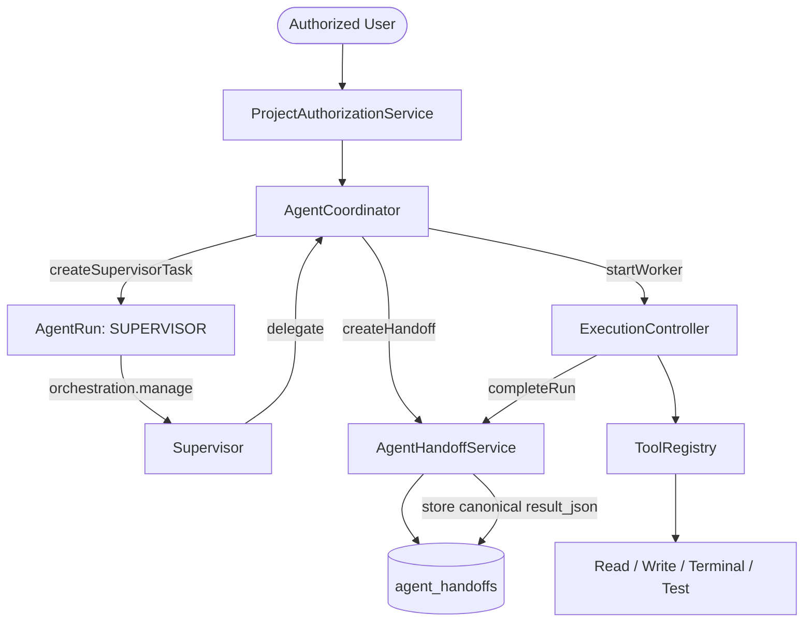

# Phase 2G.3 — AgentCoordinator + Supervisor/Worker Complete

## 1. Overview & Architecture

Phase 2G.3 establishes the multi-agent coordination layer for AI-Dost:
- **`AgentCoordinator`**: A thin orchestration engine that manages Supervisor and Worker task lifecycles without directly executing filesystem/terminal commands or bypassing security boundaries.
- **`Supervisor` Runtime**: A concrete trusted runtime role limited strictly to `orchestration.manage`. Direct filesystem writes, terminal executions, and code edits are prohibited for the Supervisor role.
- **Worker Roles**: Specialized worker roles (`RESEARCHER`, `CODER`, `VERIFIER`) assigned strictly via trusted server logic (`runtime_metadata.role`).
- **Canonical Result Persistence**: Structured worker results stored in `agent_handoffs.result_json` governed by a strict validator contract.
- **Limits & Safety**:
  - Max delegation depth = 3.
  - Max workers per supervisor task = 5.
  - Max active workers per project = 10.
  - Logical Handoff Idempotency prevents duplicate delegation.
  - Single-node Mutation Lock serializes file mutations while allowing read-only worker concurrency.



## 2. Key Components

### 2.1 `AgentCoordinator` (`backend/agent/runtime/AgentCoordinator.js`)
- `createSupervisorTask({ userId, projectId, title, prompt, metadata })`: Creates authorized task and run with `runtime_metadata.role = 'SUPERVISOR'`.
- `delegate({ supervisorRunId, role, objective, contextRefs, artifactRefs, constraints, expectedOutput })`: Validates supervisor authority, worker target role (`RESEARCHER`, `CODER`, `VERIFIER`), depth limit (max 3), worker limits (max 5 per task, max 10 per project), and uses `AgentHandoffService` for idempotent delegation.
- `startWorker(workerRunId, options)`: Starts worker run, acquires mutation lock for `CODER` role, executes through `PlannerExecutionLoop` or `ExecutionController`, records canonical `result_json`, and releases mutation lock.
- `collectWorkerResult(workerRunId, requestingUserId)`: Enforces SEC-001 tenant/user isolation, parses and validates `result_json` from the handoff record.
- `cancelWorker(workerRunId)` / `cancelTask(taskId)`: Sets status to `CANCELLED` and cascades cancellation to handoffs; late completions are strictly blocked from overwriting `CANCELLED` status.

### 2.2 `CapabilityPolicy` (`backend/agent/policy/CapabilityPolicy.js`)
- `SUPERVISOR`: `['orchestration.manage']` ONLY.
- `RESEARCHER`: `['filesystem.read', 'codebase.search', 'web.search', 'context.retrieve']`.
- `CODER`: `['filesystem.read', 'filesystem.write', 'code.edit', 'terminal.execute', 'codebase.search', 'context.retrieve']`.
- `VERIFIER`: `['filesystem.read', 'terminal.execute', 'test.run', 'verification.inspect', 'codebase.search']`.

### 2.3 `ResultValidator` (`backend/agent/runtime/resultValidator.js`)
Enforces bounded contract for `result_json`:
```json
{
  "status": "COMPLETED|FAILED|CANCELLED",
  "summary": "string <= 512 chars",
  "artifact_refs": ["artifactId <= 10 items"],
  "context_refs": ["contextId <= 10 items"],
  "verification_status": "PASSED|FAILED|SKIPPED",
  "errors": [{"code": "string <= 64 chars", "message": "string <= 256 chars"}]
}
```
Rejects raw stdout/stderr, stack traces, and secret patterns.

### 2.4 Database Migration 004 (`backend/db/migrations/004_agent_handoff_results.js`)
- Idempotently adds `result_json TEXT` column to `agent_handoffs`.
- Down migration implements SQLite-safe table rebuild preserving foreign keys, indexes, and existing data.

## 3. Concurrency & Restart Classification
- **Mutation Serialization**: In-process mutex (`LockManager`) guarantees single-process workspace serialization for `CODER` roles.
- **Read-Only Concurrency**: `RESEARCHER` and `VERIFIER` roles execute concurrently without lock contention.
- **Crash/Restart Classification**: In-process locks do not survive process restarts. Classified as **ACCEPTABLE FOR CURRENT SINGLE-NODE PHASE**.
