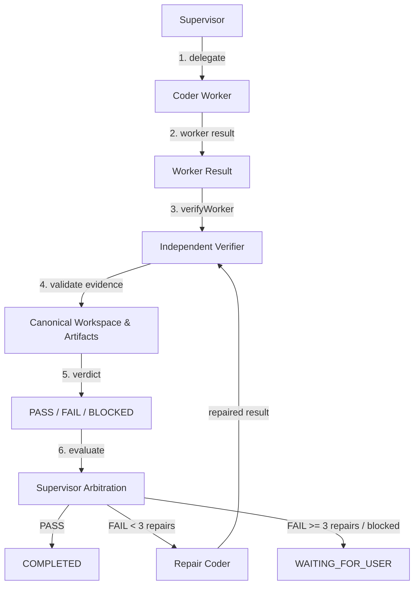

# Phase 2G.4 — Advanced Multi-Agent Verification + Arbitration Complete

## 1. Executive Summary & Flow

Phase 2G.4 implements independent verification and bounded arbitration across the AI-Dost multi-agent runtime:
- **`Supervisor`**: Orchestrates high-level tasks, delegates sub-goals to workers, and performs deterministic arbitration without voting or debate.
- **`Coder / Researcher`**: Executes implementation and research tasks; outputs structured result records.
- **`MultiAgentVerifier` (`VERIFIER` Role)**: Independently inspects the worker results without inheriting worker privileges (`filesystem.write` denied).
- **`VerificationContract`**: Enforces strict structured schema with checks (`UNIT_TEST`, `INTEGRATION_TEST`, `BUILD`, `LINT`, `FILE_INTEGRITY`, `VISUAL`, `SEMANTIC`, `SECURITY`) and bounded payloads (no secrets, no stack traces).
- **`SupervisorArbitrator`**: Determines next action (`COMPLETE`, `REPAIR`, `WAITING_FOR_USER`, `FAILED`) based strictly on independent evidence.
- **`Bounded Repair Loop`**: Verifier failure triggers bounded repair cycle to Coder (max 3 repairs) -> Re-verification -> Complete or `WAITING_FOR_USER`.



## 2. Core Components

### 2.1 Canonical Verification Contract (`backend/agent/verification/VerificationContract.js`)
```json
{
  "status": "PASS|FAIL|BLOCKED",
  "summary": "short explanation <= 512 chars",
  "evidence_refs": ["ref <= 10 items"],
  "artifact_refs": ["ref <= 10 items"],
  "failed_checks": [
    {
      "check_type": "UNIT_TEST|INTEGRATION_TEST|BUILD|LINT|FILE_INTEGRITY|VISUAL|SEMANTIC|SECURITY",
      "message": "string <= 256 chars",
      "details": "string <= 512 chars"
    }
  ],
  "confidence": 0.0
}
```
- **Validation**: Enforces bounded lengths, bans stack traces, scans and rejects API keys / secret tokens (`AIza`, `sk-`, `ghp_`, RSA private keys).
- **Determinism**: Status `PASS` strictly requires `failed_checks` to be empty.

### 2.2 `MultiAgentVerifier` (`backend/agent/verification/MultiAgentVerifier.js`)
- Runs with the least-privileged `VERIFIER` role (cannot write files or edit code).
- Context is assembled independently via `ContextAssembler` (project info, user request, worker objective, worker result refs, canonical source).
- Checks evidence freshness (rejects stale file hashes).
- Enforces tenant isolation (rejects artifacts / evidence belonging to other projects).
- Runs checks deterministically and persists `VerificationResult` records.

### 2.3 `SupervisorArbitrator` (`backend/agent/arbitration/SupervisorArbitrator.js`)
- Evaluates worker result against independent verifier findings.
- **Critical Invariant**: Worker self-declaration (`"verification_status": "PASSED"`) is **NEVER** treated as proof. Only independent verifier evidence determines task completion.
- Decides:
  - `COMPLETE`: If verifier returns `PASS`.
  - `REPAIR`: If verifier returns `FAIL` and `repairAttempt < maxRepairs` (max 3).
  - `WAITING_FOR_USER`: If `repairAttempt >= maxRepairs`, or blocked by missing human input / budget exhaustion.
  - `FAILED`: Unrecoverable failure or security violation.

### 2.4 `AgentCoordinator` Integration (`backend/agent/runtime/AgentCoordinator.js`)
- `verifyWorkerResult({ supervisorRunId, workerRunId, checks, options })`: Coordinates verifier delegation, execution, result persistence in `agent_handoffs.result_json`, and arbitration evaluation.
- `executeRepairCycle({ supervisorRunId, workerRunId, repairPayload, options })`: Executes bounded repair handoff to Coder, starts repair run, and dispatches re-verification.

## 3. Test Suite & Validation
- Dedicated test suite: `backend/tests/multiAgentVerification.test.js` (15/15 passed).
- Total backend test suite: **197 tests passed, 0 failures**.
- Scenarios tested:
  1. Coder result -> Verifier PASS
  2. Coder result -> Verifier FAIL
  3. Verification BLOCKED
  4. Stale evidence rejected
  5. Foreign-project evidence rejected (tenant isolation)
  6. Verifier cannot write workspace (`CapabilityPolicy` assertion)
  7. Verifier role least-privilege
  8. Worker result cannot self-declare PASS
  9. Supervisor receives verification result
  10. Verifier failure triggers bounded repair to Coder
  11. Repair succeeds -> Re-verification
  12. Repair limit enforced (max 3 repairs -> `WAITING_FOR_USER`)
  13. Repeated verifier disagreement
  14. Cancellation during verification
  15. Realistic E2E scenario (Supervisor -> Researcher -> Coder -> Verifier -> PASS -> Complete)

## 4. Phase 3 UI Handoff
With Phase 2G.4 complete and verified, the entire autonomous multi-agent backend foundation (Universal Store, Workspaces, Memory, RAG, Checkpoint/Resume, Supervisor/Worker, Coordinator, Independent Verification, and Arbitration) is fully operational.

**Next Milestone**: Phase 3 (Dedicated UI/UX Phase).
