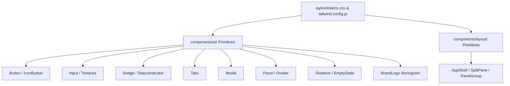

# Phase 3.2 — Design System Implementation Complete

## 1. Executive Summary

Phase 3.2 establishes the centralized design system foundation for AI-Dost without modifying individual screen logic. It eliminates generic AI template clichés (excessive glowing neon gradients, font-weight saturation, ungrounded blurs, hardcoded inline hex colors) and introduces a unified, accessible, and tactile design architecture.

---

## 2. Core Implementation Deliverables

### 2.1 Centralized Design Tokens (`frontend/styles/tokens.css`)
- **Semantic Colors**:
  - Tonal Canvas: `--color-canvas-base` (`#0c0d12`), `--color-canvas-subtle` (`#12141c`), `--color-canvas-surface` (`#181b24`), `--color-canvas-elevated` (`#202430`), `--color-canvas-overlay` (`#282d3c`).
  - Crisp Borders: `--color-border-subtle` (`rgba(255,255,255,0.05)`), `--color-border-default` (`rgba(255,255,255,0.09)`), `--color-border-strong` (`rgba(255,255,255,0.16)`), `--color-border-focus` (`#3b82f6`).
  - High Contrast Typography: `--color-text-primary` (`#f8fafc`), `--color-text-secondary` (`#94a3b8`), `--color-text-muted` (`#64748b`), `--color-text-disabled` (`#475569`).
  - Restrained Product Accent: `--color-accent` (`#3b82f6`), `--color-accent-hover` (`#2563eb`), `--color-accent-subtle` (`rgba(59,130,246,0.10)`).
  - Semantic Statuses: `--color-status-success` (`#10b981`), `--color-status-warning` (`#f59e0b`), `--color-status-error` (`#ef4444`), `--color-status-info` (`#0ea5e9`).
- **Typography Scale**:
  - Display: `text-display-xl` (28px/36px), `text-display-lg` (22px/30px).
  - Headings & Body: `text-heading-md` (16px/24px), `text-body-default` (14px/22px), `text-body-strong` (14px/22px).
  - UI & Code: `text-ui-default` (13px/18px), `text-ui-caption` (12px/16px), `text-code-sm` (12.5px/20px).
- **Motion & Accessibility**:
  - `motion-fast` (120ms), `motion-normal` (200ms), `motion-slow` (300ms) with `cubic-bezier(0.16, 1, 0.3, 1)`.
  - Full `@media (prefers-reduced-motion: reduce)` support.
  - Visible focus outline: `.focus-ring` (`outline: 2px solid var(--color-border-focus)`).

### 2.2 Brand & Logo Primitive (`frontend/components/ui/BrandLogo.jsx`)
- Scalable dual-tone geometric monogram ("D" node + terminal cursor) supporting sizes `xs` (16px), `sm` (20px), `md` (24px), `lg` (32px), `xl` (48px).

### 2.3 Core UI Primitives (`frontend/components/ui/`)
- `Button.jsx` & `IconButton.jsx`: Supports variants (`primary`, `secondary`, `subtle`, `danger`, `ghost`), sizes (`xs`, `sm`, `md`, `lg`), loading spinner, disabled state, and keyboard focus.
- `Input.jsx` & `Textarea.jsx`: Form controls with label, hint, error states, and icon slots.
- `Badge.jsx` & `StatusIndicator.jsx`: Status indicators for agent runtime states (`running`, `idle`, `success`, `warning`, `error`).
- `Tabs.jsx`: Pill and line tab variants with badge support.
- `Modal.jsx`: Accessible modal dialog with backdrop, ESC key listener, and focus trapping.
- `Panel.jsx` & `Divider.jsx`: Structural panel containers with header and footer slots.
- `Skeleton.jsx` & `EmptyState.jsx`: Tactile loading placeholders and context-aware zero-data views.

### 2.4 Shared Layout Primitives (`frontend/components/layout/`)
- `AppShell.jsx`: Main application shell with sticky header, sidebar rail, and scrollable content area.
- `SplitPane.jsx` & `PanelGroup.jsx`: Multi-pane layouts for IDE and workbench views.

---

## 3. Test & Verification Summary

- **Frontend Jest Suite**:
  - `frontend/tests/designSystem.test.jsx`: 16/16 passed.
  - Total frontend tests: **6 suites, 44 tests passed, 0 failures**.
- **Frontend Linter**:
  - `npm run lint`: 0 errors.
- **Backend Regression**:
  - Total backend tests: **98 tests passed, 0 failures**.
  - Verified zero impact on backend/agent runtime.
- **Git Hygiene**:
  - `git diff --check`: 0 errors / 0 whitespace issues.

---

## 4. Next Milestone: Phase 3.3

Phase 3.3 will begin applying the new design system to the product shell and navigation:
- `Sidebar.jsx` (collapsed 72px rail / expanded 260px categorized drawer).
- `TopBar.jsx` (project switcher, agent status indicator, global command palette).
- Header & Footer harmonization.
