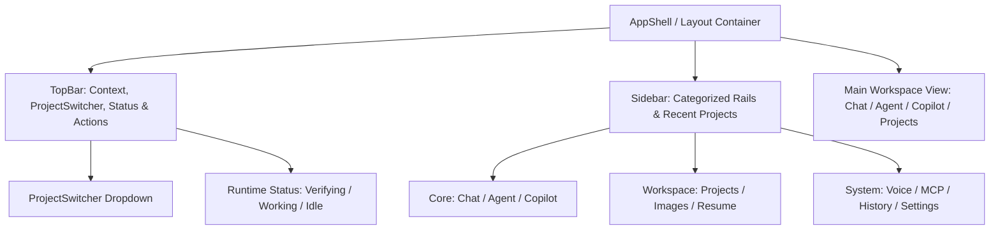

# Phase 3.3 — App Shell, Navigation & Information Architecture Complete

## 1. Executive Summary

Phase 3.3 delivers the first tangible product screen redesign by re-architecting the AI-Dost Application Shell, Navigation System, and Top Bar. It transforms the interface into a dense, quiet, and tactile developer workbench, eliminating generic SaaS cards and glowing gradients while maintaining 100% backward compatibility with all existing application views.

---

## 2. Core Implementation Deliverables

### 2.1 App Shell & Navigation (`frontend/components/Sidebar.jsx`)
- **Categorized Information Architecture**:
  - **Core Workspace**: Chat, Autonomous Agent (`Beta`), Copilot IDE (`New`).
  - **Projects & Artifacts**: Projects, Generated Images / Gallery, Resume Builder.
  - **Tools & System**: Voice Assistant (`Live`), MCP Connectors, History, Settings.
- **Visual & Interaction Details**:
  - Crisp active state indicated by a 3px accent bar on the left edge, subtle surface contrast (`bg-canvas-surface`), high-contrast text (`text-txt-primary`), and active icon highlight.
  - Collapsed rail mode (72px) with centered icon buttons and accessible tooltips.
  - Expanded rail mode (260px) with clean monospace section titles (`WORKSPACE`, `PROJECTS & ARTIFACTS`, `TOOLS & SYSTEM`).
  - Integrated "+ New Chat" quick trigger and recent project list with "+ New" project button.
  - Full keyboard accessibility: `aria-current="page"`, `aria-expanded`, `aria-label`, and `.focus-ring`.

### 2.2 Top Bar & Global Controls (`frontend/components/TopBar.jsx`)
- **Restrained Header (56px / h-14)**:
  - Left: Context-aware view title (`Sora` font-display) and section subtitle.
  - Center: Integrated `ProjectSwitcher` dropdown and live agent runtime status indicator (`StatusIndicator` with status pulse).
  - Right: Quick command palette button (Ctrl+K), inference model selector dropdown (Auto Cascade, Gemini, Groq, DeepSeek, NVIDIA, OpenRouter, Ollama Local), theme toggle (Moon/Sun), and voice assistant shortcut.
- Clean token-based background (`bg-canvas-base`, border `border-border`).

### 2.3 Compact Project Switcher (`frontend/components/ui/ProjectSwitcher.jsx`)
- High-clarity dropdown showing active project name, search filter input for >4 projects, checkmark for current selection, and "+ New Project" quick creation button.
- Handles empty project list gracefully ("No projects created yet").

---

## 3. Test & Verification Summary

- **Frontend Jest Suite**:
  - `frontend/tests/appShell.test.jsx`: 5/5 passed.
  - `frontend/tests/sidebarNavigation.test.jsx`: 5/5 passed.
  - `frontend/tests/Sidebar.test.jsx`: 6/6 passed.
  - Total frontend tests: **8 suites, 54 tests passed, 0 failures**.
- **Frontend Linter**:
  - `npm run lint`: 0 errors.
- **Backend Regression**:
  - Total backend tests: **98 tests passed, 0 failures**.
- **Git Hygiene**:
  - `git diff --check`: 0 errors / 0 whitespace warnings.

---

## 4. Next Milestone: Phase 3.4

Phase 3.4 will begin the dedicated redesign of the **Chat UX & Editorial Stream**:
- Replace giant bubble containers with a clean, full-width editorial conversation stream.
- Structured tool execution blocks (File Read, File Write, Terminal Command).
- Verification evidence badges and inline artifact previews.
