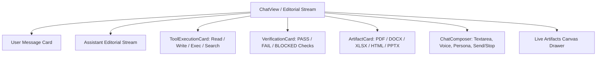

# Phase 3.4 — Chat UX Redesign Complete

## 1. Executive Summary

Phase 3.4 delivers the dedicated Chat Experience redesign, transforming `ChatView` into an editorial conversation stream. It eliminates generic chatbot bubbles, pulsing neon orbs, and rainbow gradients, replacing them with structured message types, expandable tool execution blocks, Phase 2G independent verification cards, compact document artifact previews, and a tactile composer.

---

## 2. Core Implementation Deliverables

### 2.1 Structured Message Hierarchy (`frontend/components/chat/MessageStream.jsx`)
- **User Message**: Clean, offset-aligned card with high-contrast typography (`text-txt-primary`), subtle border (`border-border`), and contextual copy button on hover.
- **Assistant Message**: Full-width editorial stream featuring `BrandLogo` monogram, clean markdown headings, and JetBrains Mono code blocks equipped with language badge and Copy/Run triggers.
- **Thinking Indicator**: Quiet, restrained status pill (`Loader2 animate-spin` with "Synthesizing response... Evaluating multi-model cascade").

### 2.2 First-Class Tool Execution Cards (`frontend/components/chat/ToolExecutionCard.jsx`)
- Compact structured representation of tool actions (`read_file`, `write_file`, `run_command`, `search_code`, `verify`).
- Displays tool name, target path/command, duration timestamp, status badge (`running`, `success`, `error`), and expandable stdout/stderr block.

### 2.3 Independent Verification Cards (`frontend/components/chat/VerificationCard.jsx`)
- First-class UI representation of Phase 2G multi-agent verification.
- Displays overall verdict badge (`PASS`, `FAIL`, `BLOCKED`), summary description, and individual check chips (`UNIT_TEST`, `LINT`, `SECURITY`, `FILE_INTEGRITY`).

### 2.4 Document & Artifact Previews (`frontend/components/chat/ArtifactCard.jsx`)
- Compact, elegant preview cards for generated files (PDF, Word DOCX, Excel XLSX, CSV, PowerPoint PPTX, HTML/SVG).
- Features quick "Preview in Canvas" and direct download triggers.

### 2.5 Tactile Chat Composer (`frontend/components/chat/ChatComposer.jsx`)
- Auto-resizing textarea with clean focus ring and token-based surface styling.
- Integrated persona/tone badge, Voice input button (`Mic`), file attachment trigger (`Paperclip`), and clear Send / Stop Generation state buttons.

---

## 3. Test & Verification Summary

- **Frontend Jest Suite**:
  - `frontend/tests/chatUx.test.jsx`: 4/4 passed.
  - `frontend/tests/chatStates.test.jsx`: 2/2 passed.
  - Total frontend tests: **10 suites, 62 tests passed, 0 failures**.
- **Frontend Linter**:
  - `npm run lint`: 0 errors.
- **Backend Regression**:
  - Total backend tests: **98 tests passed, 0 failures**.
- **Git Hygiene**:
  - `git diff --check`: 0 errors / 0 whitespace issues.

---

## 4. Next Milestone: Phase 3.5

Phase 3.5 will focus on the **Autonomous Agent Workbench & Kanban Redesign** (`AgentView.jsx`):
- Supervisor task header (objective, delegation depth, worker count).
- Multi-agent timeline (`RESEARCHER`, `CODER`, `VERIFIER`).
- Interactive human approval banner (`WAITING_FOR_USER`).
- Tactile Kanban task board with drag-and-drop state synchronization.
