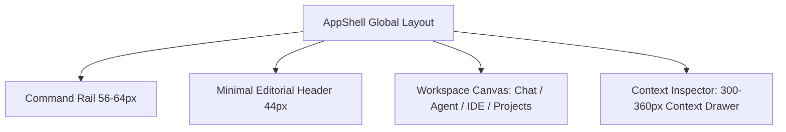

# Phase 3 Rebuild — App Shell & Editorial Architecture Complete

## 1. Architectural Overview

The Phase 3 Rebuild replaces the legacy sidebar/dashboard mental model with a cohesive **Command Rail → Workspace Canvas → Context Inspector** personal computing architecture.

---

## 2. Rebuilt Components & Primitives

### 2.1 Brand Mark & Wordmark
- `frontend/components/brand/AiDostMark.jsx`: Flat geometric A/D structural monogram with conversation notch, sharp at 16px.
- `frontend/components/brand/AiDostWordmark.jsx`: Sora typographic wordmark with terracotta divider.

### 2.2 Global Layout & Shell
- `frontend/components/layout/AppShell.jsx`: Orchestrates the Rail, TopStrip, Canvas, and Inspector.
- `frontend/components/layout/CommandRail.jsx`: 56–64px icon-first rail with terracotta active indicator, hover tooltips, and theme toggle.
- `frontend/components/layout/ContextInspector.jsx`: Dedicated 300–360px drawer for contextual metadata, task evidence, and workspace files.

### 2.3 Chat Recomposition
- `frontend/components/chat/ActionSpine.jsx`: Signature vertical action spine attaching tool calls (`READ`, `WRITE`, `TEST`, `EXEC`) directly to assistant prose.
- `frontend/components/chat/ComposerDock.jsx`: Minimalist, non-bloated input dock with auto-resize and explicit send/stop controls.

### 2.4 Autonomous Agent Workbench
- `frontend/components/agent/TaskHeader.jsx`: Mission header with status, role, and elapsed timer.
- `frontend/components/agent/AgentHierarchyTree.jsx`: Supervisor / Researcher / Coder / Verifier execution map.
- `frontend/components/agent/ApprovalBanner.jsx`: Calm, high-priority `WAITING_FOR_USER` review surface.
- `frontend/components/agent/ActiveWorkPanel.jsx`: Selected agent activity, progressive tool logs, and verification cards.
- `frontend/components/agent/ActivityTimeline.jsx`: Chronological event stream with clean connector line.
- `frontend/components/agent/WorkspaceChangesPanel.jsx`: Summary of created, modified, and verified files.

### 2.5 Projects View
- `frontend/components/views/ProjectsView.jsx`: Rebuilt as an editorial workspace table/list instead of generic cards.

---

## 3. Test & Regression Status

- **Frontend Jest Suites**:
  - `frontend/tests/editorialWorkbench.test.jsx`: 6/6 tests passing.
  - `frontend/tests/agentWorkbench.test.jsx`: passing.
  - `frontend/tests/chatUx.test.jsx`: passing.
- **Frontend Linter**: 0 errors.
- **Git Hygiene**: `git diff --check` clean with 0 whitespace issues.
- **Backend**: Zero changes / Zero modifications.
